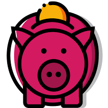
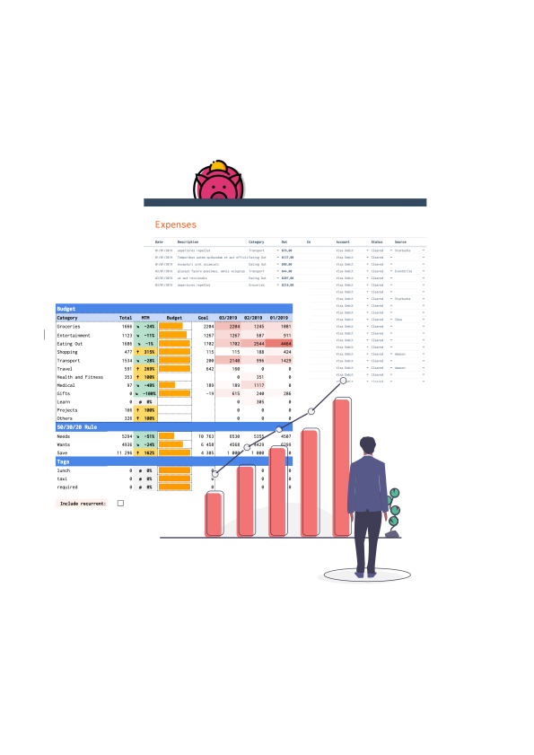

	 
	 
	 
	 
	 
  
	 
	<h3><a href="https://onabudget.works">On A Budget</a></h3>
	 
	 
	
	 
	 
	The little spreadsheet that could. <a
	target="_blank" href="https://onabudget.works">Go get it</a>.
	 
	
	 
	 
	 
	 

---

 
 
 

**On A Budget is a simple Google spreadsheet to track your expenses, incomes
and budgets. That's it. Only what you need, carefully designed by people who
needed the same tool than you while still controlling it entirely. It saves you
the hassle of searching for apps or resources and let you start now to grow
your finance.**

 

  <i>The project is about to go live! Watch this repository and you will be
  notified :)</i>

 

This repository will serve 2 important purposes for power users:

- Gathering feedback, issues and suggestions
- Start tech-related features, like command line interfaces, Google
scripts, frontends, you name it.

Stay tune.

 
 

  
  

## Acknowledgments

- Powered by [Google Spreadsheet](https://docs.google.com/spreadsheets/)
- Inspired by [The Balance](https://www.thebalance.com/)

---

	 
	 
  The little spreadsheet that could.
	 Built by
  <a href="https://twitter.com/yoshuawuyts">Brigida Ranieri</a> and
  <a href="https://github.com/xav-b/on-a-budget/graphs/contributors">
    contributors
  </a>
	 with a </i>💻<i> and some </i>🍣

	 
	 
	
	 
	 

